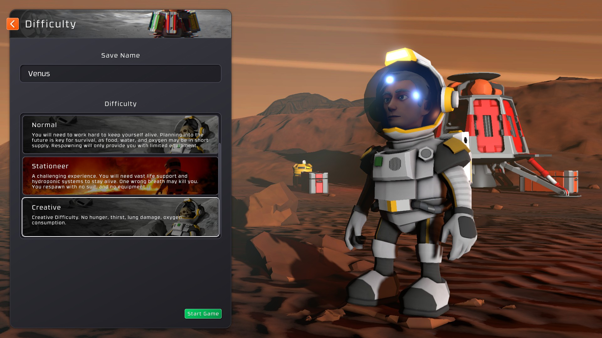
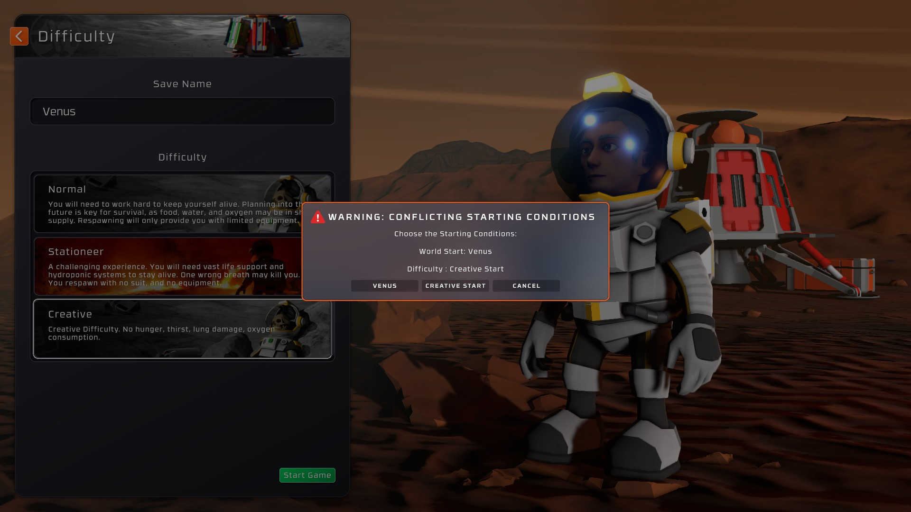

# Difficulty Starting Conditions
This mod enables custom difficulties to have their starting conditions used instead of the "Default" starting condition that Stationeers enforces when loading a non-custom New World.

If the wold has it's own starting conditions, and the difficulty's is "Default", it will automatically select the world's setting. The same for when the world is "Default" and the difficuly has one.
If the world **and** the difficulty setting both have non-"Default" starting conditions, this mod will warn and ask you which set of conditions you want to use.

An example would be Venus and my CreativeDifficulty mod.
_)
Venus has it's own starting condition named "Venus" and the mod's is "Creative Start".

You can, of course, Cancel and go back to select something else.